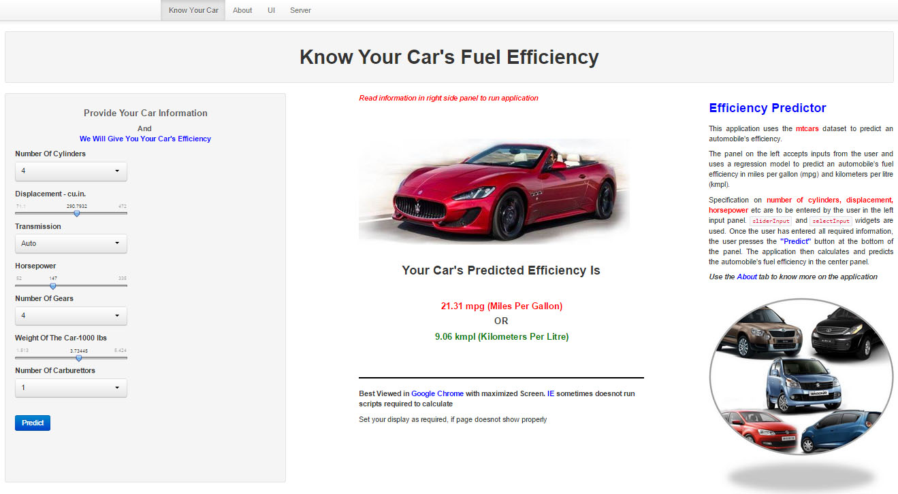
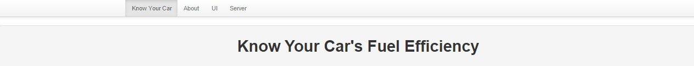
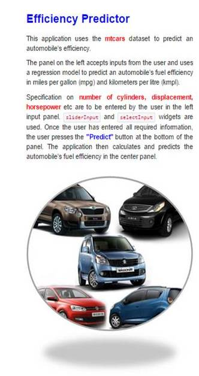
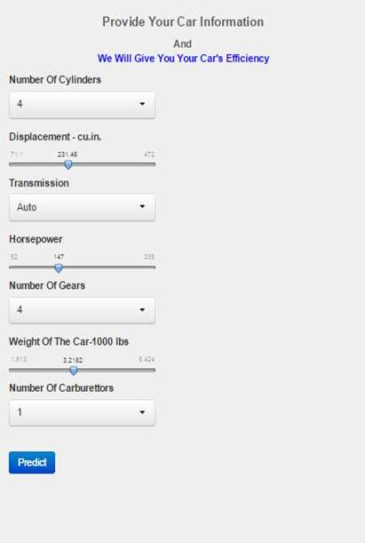
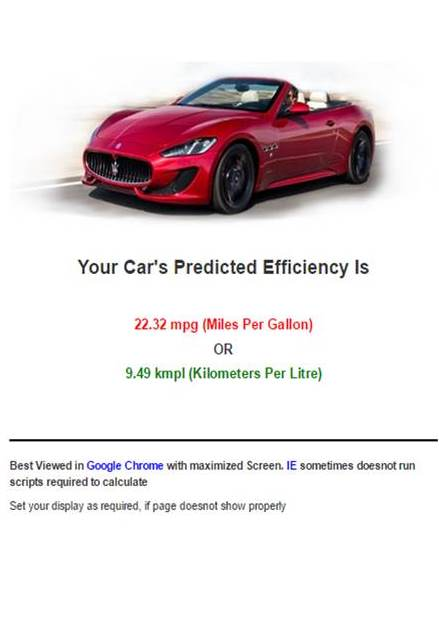

<style>.footer {color: white;position: fixed; top: 90%;width:100%;}</style>

Know Your Car's Fuel Efficiency
==========
author: 
date: Nov 2014
width: 1024
height: 768
transition: rotate
autosize: True
<div class='footer'> Course Project : Developing Data Products-Coursera</div>


Introduction
=========

<font size='5'>**Know Your Car's Fuel Efficiency** is an application that uses a truncated **mtcars** data set to predict an automobile's fuel efficiency. It has been created in **R:Shiny**. It consists of three panels. A left panel for user input, a center panel to display the prediction, both in mpg (miles per gallon) and kmpl (kilometers per litre) and a right panel, which provides user-friendly information on the application and method to use it.</font>

</img>

Application Base
========
The truncated **mtcars** data set has the following structure:<font size='5'>

```
'data.frame':	32 obs. of  8 variables:
 $ mpg : num  21 21 22.8 21.4 18.7 18.1 14.3 24.4 22.8 19.2 ...
 $ cyl : num  6 6 4 6 8 6 8 4 4 6 ...
 $ disp: num  160 160 108 258 360 ...
 $ hp  : num  110 110 93 110 175 105 245 62 95 123 ...
 $ wt  : num  2.62 2.88 2.32 3.21 3.44 ...
 $ am  : num  1 1 1 0 0 0 0 0 0 0 ...
 $ gear: num  4 4 4 3 3 3 3 4 4 4 ...
 $ carb: num  4 4 1 1 2 1 4 2 2 4 ...
```
</font>
***
A linear regression model is used to predict fuel efficiency for automobiles. The summary of the model is as follows:<font size='4'>

```

Call:
lm(formula = mpg ~ ., data = mcars)

Residuals:
    Min      1Q  Median      3Q     Max 
-3.9423 -1.5384 -0.4756  1.5977  5.4866 

Coefficients:
             Estimate Std. Error t value Pr(>|t|)    
(Intercept) 34.175192   8.275148   4.130 0.000379 ***
cyl         -0.848034   0.818541  -1.036 0.310514    
disp         0.006232   0.016107   0.387 0.702254    
hp          -0.021626   0.020359  -1.062 0.298722    
wt          -2.671359   1.542550  -1.732 0.096149 .  
am           1.623850   1.781095   0.912 0.370986    
gear         0.585863   1.446968   0.405 0.689145    
carb        -0.472363   0.741067  -0.637 0.529892    
---
Signif. codes:  0 '***' 0.001 '**' 0.01 '*' 0.05 '.' 0.1 ' ' 1

Residual standard error: 2.585 on 24 degrees of freedom
Multiple R-squared:  0.8576,	Adjusted R-squared:  0.8161 
F-statistic: 20.65 on 7 and 24 DF,  p-value: 1.028e-08
```
</font>

Title And Information Zone
========
<b>Title Zone:</b>

<b>Info Pane:</b>

***

<font size='5' color='grey'>The Title screen is at the top of the screen and just calls out a short title capturing the central theme of the application. It uses the **wellPanel** and **h1** feature of shiny to provide a user-friendly description for the application.</font>

<font size='5' color='blue'>The information panel is located to the right of the screen. It provides information on the application and method to use the application. It's user-friendly and uses many of the formatting features provided in shiny to provide it an attractive look.</font> 

Input Zone
==========

***

<font size=4>The input panel is located to the left of the screen and accepts user input to predict automobile efficiency.
It has a title panel, four ***text panels*** and three ***sliders*** to facilitate information input.

1. **Number Of Cylinders** - Number of cylinders in the car.
2. **Displacement-cu.in.** - Total cylinder displacement in cubic inches.
3. **Transmission** - Type of transmission, auto or manual.
4. **Horsepower** - Engine horsepower of car.
5. **Number Of Gears** - Number of gears in car.
6. **Weight Of The Car -1000 lbs** - Weight of the car in 1000's of pounds.
7. **Number Of Carburettors** - Number of carburettors in the car.

</font>


Prediction Zone
========================================================
left:40%
<div class='footer' style="margin-top:-50px;color:black;font-size:65%">
<hr>
<p><b>Possible Improvements :</b></p>
<p>- Use a more refined regression model after accounting for correlated features.</p>
<p>- Application to be progammed to show a picture of the car based on user inputs.</p></div>

***
<font size='5'>This panel is located to the center of the screen. Application calculates and shows prediction of an automobile's efficiency in this screen. Based on user input, fuel efficiency of the car is shown in miles per gallon and kilometers per litre. <b><font color="red">Figures in red</font></b> are miles per gallon and <b><font color='green'>figures in green</font></b> are kilometers per litre.

Application doesnot show calculations in **IE** sometimes, but, shows up clearly in **Google Chrome** or other modern browsers. Shows up well in maximized screens. Adjusting the display width and height would also help it showing it well.</font>
